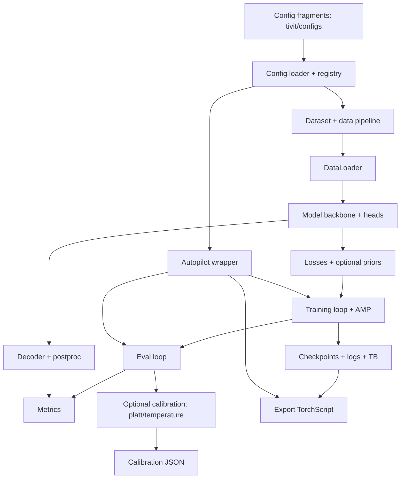

# New Implementation Summary

Scope: new stack only (`tivit/`), excluding legacy `src/` and root `scripts/` unless a wrapper explicitly targets the new stack.

## Overview
- Config + registry: `tivit/core/config.py`, `tivit/core/registry.py`, YAML fragments under `tivit/configs/`.
- Infrastructure utils: `tivit/utils/*.py` (AMP, logging, fs, timing).
- Data pipeline: `tivit/data/` (decode -> registration -> augment -> normalize -> tiling -> sync -> targets).
- Models + heads: `tivit/models/backbones/*.py`, `tivit/models/heads/*.py`.
- Training/eval/export: `tivit/train/*.py`, `tivit/pipelines/*.py`.
- Decoder + postproc: `tivit/decoder/*.py`, `tivit/postproc/*.py`.
- Optional priors: training-time in `tivit/priors/*.py`, decode-time key prior in `tivit/postproc/`.

## Flowchart

## New Implementation Status vs Legacy
Status legend: Full = implemented parity, Partial = reduced scope, Mixed = combination of real + placeholder, Stub = no-op placeholder.

| Area | Key files | Status vs legacy | Notes |
|---|---|---|---|
| Config + registry | `tivit/core/config.py`, `tivit/core/registry.py` | Full | Matches legacy composition/registration behavior. |
| Infrastructure utils | `tivit/utils/*.py` | Full | Scoped to AMP/logging/fs/timing; domain helpers live in `tivit/core` and `tivit/data`. |
| Data pipeline | `tivit/data/**` | Full | No stubs found. |
| Models + heads | `tivit/models/**` | Full | Full head set implemented. |
| Losses + metrics | `tivit/losses/**`, `tivit/metrics/**` | Full | Full stack present. |
| Train + eval + export | `tivit/train/**`, `tivit/pipelines/*.py` | Full | New stack entrypoints; eval decodes logits and reports event F1 via `tivit/metrics/event_f1.py`. |
| Decoder + thresholding | `tivit/decoder/**`, `tivit/postproc/*.py` | Full | Hysteresis + thresholding implemented. |
| Autopilot | `tivit/pipelines/autopilot.py` | Partial | Train -> eval -> export only; no selection/calibration orchestration. |
| Calibration utilities | `tivit/calibration/*.py`, `tivit/pipelines/calibrate.py` | Partial | Basic threshold sweep added; temperature/platt fitting not yet ported. |
| Priors | `tivit/priors/*.py`, `tivit/postproc/key_signature.py`, `tivit/postproc/key_prior_runtime.py`, `tivit/postproc/hand_gate_runtime.py` | Mixed | Training-time priors apply in the loss; decode-time key signature prior and hand gate apply in postproc; chord smoothness is placeholder. |
| Postproc constraints | `tivit/postproc/min_note_length.py`, `tivit/postproc/harmony_filter.py` | Stub | No-op placeholders. |

## Legacy CLI Parity Matrix
Status legend: Full = equivalent new-stack wrapper, Partial = some overlap, None = no new-stack equivalent.

| Legacy script | New implementation equivalent | Status |
|---|---|---|
| `scripts/train.py` | `scripts/tivit_train.py` (wraps `tivit/pipelines/train_single.py`) | Full |
| `scripts/train_autopilot.py` | `scripts/tivit_autopilot.py` (wraps `tivit/pipelines/autopilot.py`) | Partial |
| `scripts/calib/calibrate.py` | None (legacy-only) | None |
| `scripts/calib/calibrate_thresholds.py` | `tivit/pipelines/calibrate.py` | Partial |
| `scripts/calib/calibrate_thresholds_legacy.py` | None (legacy-only) | None |
| `scripts/calib/eval_thresholds.py` | None (legacy-only) | None |
| `scripts/calib/eval_thresholds_legacy.py` | None (legacy-only) | None |
| `scripts/calib/dump_labels.py` | None (legacy-only) | None |
| `scripts/calib/inspect_ckpt.py` | None (legacy-only) | None |
| `scripts/calib/lag_sweep.py` | None (legacy-only) | None |
| `scripts/calib/make_calib_split.py` | None (legacy-only) | None |
| `scripts/calib/parse_sweep.py` | None (legacy-only) | None |
| `scripts/calib/sweep.py` | None (legacy-only) | None |
| `scripts/calib/threshold_utils.py` | None (legacy-only) | None |
| `scripts/check/analyze_class_balance.py` | None (legacy-only) | None |
| `scripts/check/check_hand_label_utils.py` | None (legacy-only) | None |
| `scripts/check/check_model.py` | `tivit/tests/test_vivit_forward.py`, `tivit/tests/test_vits_tile_forward.py` | Partial |
| `scripts/check/check_omaps_integrity.py` | `tivit/tests/test_dataset_omaps.py` | Partial |
| `scripts/check/check_pianovam_integrity.py` | `tivit/tests/test_dataset_pianovam.py` | Partial |
| `scripts/check/check_pianoyt_integrity.py` | `tivit/tests/test_dataset_pianoyt.py` | Partial |
| `scripts/check/check_registration_cache.py` | `tivit/tests/test_registration.py` | Partial |
| `scripts/check/diagnose_onset_offsets.py` | None (legacy-only) | None |
| `scripts/check/test_conf.py` | None (legacy-only) | None |
| `scripts/check/test_forward.py` | `tivit/tests/test_vivit_forward.py`, `tivit/tests/test_vits_tile_forward.py` | Partial |
| `scripts/check/test_key_prior.py` | None (legacy-only) | None |
| `scripts/check/test_labels.py` | `tivit/tests/test_targets_alignment.py` | Partial |
| `scripts/check/test_loader.py` | `tivit/tests/test_dataset_*.py` | Partial |
| `scripts/check/test_refinement.py` | `tivit/tests/test_registration.py` | Partial |
| `scripts/check/test_synthetic_forward.py` | `tivit/tests/test_vivit_forward.py`, `tivit/tests/test_vits_tile_forward.py` | Partial |
| `scripts/check/test_tile_support_cache.py` | None (legacy-only) | None |
| `scripts/eval_pianovam.py` | `scripts/tivit_eval.py` + `tivit/metrics/event_f1.py` | Partial |
| `scripts/theory_decode.py` | `tivit/postproc/key_signature.py` (no CLI) | None |
| `scripts/probe_timegrid.py` | None (legacy-only) | None |
| `scripts/rebuild_av_lags.py` | None (legacy-only) | None |
| `scripts/clean_tivit.py` | None (legacy-only) | None |
| `scripts/dev/gen_file_index.py` | None (legacy-only) | None |
| `scripts/dev/gen_repo_tree.py` | None (legacy-only) | None |
